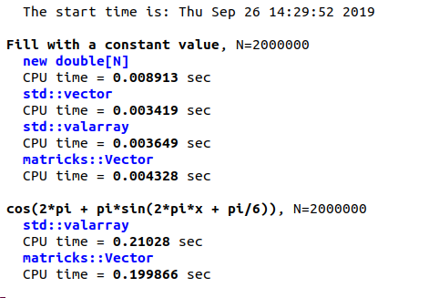

# mātricks v2.27-r3

- CURRENTLY NOT READY FOR USE BUT...
+ V3.0 is almost ready.  I put the last pieces together for the code to work with arbitrary rank tenors (Scalar, Vector, Matrix, etc):
  + no boiler-plates. all are processed by the same functions
  + no loss of elegance and simplicity in use
  + no real-time cost
+ I started the test code. I added over 200 test cases, with a very clear and elegant output.
+ Online [User's Guide](doc/README.md) in progress
+ [TO-DO List](todo/README.md)
+ I ran benchmarks vs. a handcoded for loop. The results are impressive (-O3 optimization):


where the second code comparision is hand-coded loop 
```C++
std::valarray<double> x(N);
for(int i=0; i<N; i++)
  x[i] = double(i)/double(N-1);
std::valarray<double> f(N);
start_timer();
for(int i=0; i<N; i++)
     f[i] = cos(2*pi + pi*sin(2*pi*x[i] + pi/6));
stop_timer();
```

vs matricks syntax 
```C++
Vector<double> x(N);
x = linspace<double>(0,1,N);
Vector<double> f(N);
start();
f = cos(2*pi + pi*sin(2*pi*x + pi/6));
stop();
```

mātricks is numerical library for performing linear algebra in C++ via simple MATLAB-like syntactic sugar while also providing run-time performance and memory usage on par with hand-coded C or Fortran.

Advantages
+ object-oriented matrices and vectors
+ run-time performance and memory usage on par with optimized C or and Fortran
+ simple MATLAB-like syntactic sugar 
  + slices of vectors and matrices
  + add two matrices is `A+B`
  + matrix-vector multiply is `A|x` (`|` is symbol used for inner product)
  + extremely efficient matrix-matrix multiply `A|B`
  + element-wise multiply is `A*B`
  + complicated expressions supported `(A + B - 33.14*C)|(2*x + y)` *without* run-time overhead and no intermediate objects
  + complex number support
  + functions of matrices/vectors supported: `sin(x)`, `exp(A)` etc
  + SVD and Eiegenvalue decomposition supported via LAPACK
  + matrix inverse: `inv(A)`
+ does *not* produce intermediate objects (which crush run-time performance and inflate memory usage)
+ expressions are computed in a single for loop
+ hand-optimized matrix multiply
+ pretty formatted output of vectors and matrices
+ simple file i/o of vectors and matrices
+ Online [User's Guide](doc/README.md) in git markdown
  + clear documentation of every feature
  + documentation is generated from C++ code using the library itself
+ `MEBUG` debugging compile mode produces extensive information to aid in debugging
  + out of bounds access for vectors or matrices (e.g. x[10] where x is a
   vector of length 6.
  + adding/subtracting/multiplying/dividing vector or matrices of unequal
   size
  + invalid dot products of vector and/or matrices 
  + other assorted errors


---------------------------------------------------------------------------

# DEVELOPMENT

Development for this project originally took place during the years 2003-2008 

The code resurrected in 2019, imporved, and put on github.

The code uses a form of C++ [template metaprogramming](https://en.wikipedia.org/wiki/Template_metaprogramming) called [expression templating](https://en.wikipedia.org/wiki/Expression_templates), the library provides computational efficiency on par with C/Fortran.

*Expression templating* produces complex code in the library itself, but the *user code* is simple, clean, and extremely efficient.

# LICENSE 

The code that makes up this library is copyrighted under the *MIT license*.

[Read the LICENSE file for details](LICENSE).

# INSTALLATION

The first step is to clone the repo

```git clone https://github.com/ron2015schmitt/matricks.git```

You now have a directory with all the mātricks source code

# CONFIGURATION

cd into the matricks directory and execute the configure command:

```
cd matricks
./configure
```

# USING THE mātricks LIBRARY

To use the mātricks library you need to 

1. Include the library file `include/matricks.h` in your source code
```C++
#include "matricks.h"
```
2. Include the `include/` subdirectory during compilation using the `-I` option

3. Include the `lib/` subdirectory during linking using the `-L` option

4. Include the option `-lmatricks` during linking

## EXAMPLE CODE FILE

An example of a C++ source file (```examples/example.cpp```) is shown below

```C++

#include "matricks.h"


int main(int argc, char *argv[])
{
  const double pi = M_PI;
  std::string myname = argv[0];
  
  using namespace matricks;
  using namespace display;

  // force color even if piped to more,less or a file
  Terminal::setColorOverride(true);
  Terminal::setOverrideValue(true);

  cr();
  cr();
  mout << StyledString::get(HORLINE);
  mout << "running: " <<createStyle(BOLD).apply(myname) << std::endl;

  
  mout<< "MATRICKS_DEBUG=" << MATRICKS_DEBUG << std::endl;
  print_matricks_info();
  
  Vector<double> v1( linspace<double>(-1,1,21) );
  Vector<double> v2;
  v2 = 10*sin(pi/2*v1) + 10;

  disp(v1);
  disp(v2);
  disp(v1+v2);

  // dot product
  disp(v1|v2);

  const double N = double(v2.size());
  // mean
  double mu2 = sum(v2)/N;
  disp(mu2);

  // std deviation
  double sigma2 = norm(v2-mu2)/sqrt(N-1);
  disp(sigma2);

  cr();
  mout << "done: " << createStyle(BOLD).apply(myname) << std::endl;
  mout << StyledString::get(HORLINE);
  cr();

  
  return 0;
}
```

Compile the code and run the code using
```bash
g++ -I ~/matricks/include example.cpp -o example -L ~/matricks/lib -lmatricks
./example
```

## EXAMPLE MAKEFILE

A example makefile, ```examples/Makefile```,  is included for your convenience 

*AFTER CONFIGURATION*, copy this makefile to YOUR source code directory (or cut and paste into an existing makefile).


# EXTENSIVE DEBUGGING SUPPORT

The mātricks library provides extensive debugging operation, turned on using the flag `MEBUG`.   The word `MEBUG` was chosen over `DEBUG` to avoid clashing with other code (libraries).

In this mode extensive error checking is performed to notify the user of

 - out of bounds access for vectors or matrices (e.g. x[10] where x is a
   vector of length 6.
 - adding/subtracting/multiplying/dividing vector or matrices of unequal
   size
 - invalid dot products of vector and/or matrices 
 - other assorted errors and warnings


## SETTING `MEBUG` MODE

There are two methods to accomplish this.

### RECOMMENDED METHOD: Use the provided sample makefile and specify `MEBUG=1` on the command line

example:

```make clean MEBUG=1 myprogram```


The target `clean` is not needed, but is a reccomended practice.

If you want to recompile in fast mode, just use the makefile
without specifying the `MEBUG` flag

```make clean myprogram```


### EXPLICIT METHOD: Add a `#define MEBUG 1` statement BEFORE each `matricks.h` include statement

```C++
#define MEBUG 1
#include "matricks.h"
```


## RECOMMENDATIONS

While developing your code, use `MEBUG` mode.  When you are convinced that it is operating
without errors or warnings, run normally.  

Compile a `MEBUG` and a quick version of your code, giving the executables different names.
This way if a segmentation fault occurs, or you otherwise suspect an error, you can quickly
check the problem under careful mode.


##  NOTES

Compile time is also considerably slower in MEBUG mode.

# DOCUMENTATION

[User's Guide](doc/README.md)

