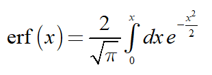

# Calculus in mātricks
_This document was automatically generated from file_ **`calculus.cpp`** (mātricks-v2.14-r3).

## Integration
### Definite integrals
Integrating over an interval [a,b] yields a single number--the area under the curve.


**EXAMPLE 1**: Definite integrals
```C++
const size_type N = 100000;
const double a = 0 + 1/double(N);
const double b = 1 - 1/double(N);
Vector<double> x(linspace<double>(a,b,N-1));
Vector<double> f;
f=-log(log(1/x));
```

Integrating f(x), as given above, yields the [Euler–Mascheroni](http://mathworld.wolfram.com/Euler-MascheroniConstant.html) constant whose exact value is `0.577215664901532...`.  The function _f_(_x_) is singular at both x=0 and x=1.  Thus we omitted these points. As the results show, this simple approach to the integral isn't particularly accurate. 

 

**Results**
```C++
  N = 100000; 
  a = 1e-05; 
  b = 0.99999; 
  integrate_a2b(f,a,b,0) = 0.577156; 
  integrate_a2b(f,a,b,1) = 0.577117; 
  integrate_a2b(f,a,b,2) = 0.577116; 
```

### Semi-Definite Integrals
A semi-definite integral is created by replacing one of the end points with _x_.


A semi-definite integral yields a function as its output.
Integration requires a cumulative sum.  Thus the caculation can not be accomplished via element-wise operations.  For this reasons these functions are performed in place, mimizing both memory usage and computation time.
All of the remaining functions discussed in this section modify the vector _in place_.


**EXAMPLE 2**:  The error function integral
The _error function_ is the following semi-definite integral of the Gaussian function.


```C++
Vector<double> v1(5);
```

**Results**
```C++
```

## Differentiation
 Differentiation requires points around it. For this reasons these functions are performed in place, mimizing both memory usage and computation time.


**EXAMPLE 3**: Derivatives
```C++
Vector<double> v1(5);
```

**Some expressions with results**
```C++
```

## Various related functions
All of these functions modify the vector _in place_.


**EXAMPLE 4**: Various functions: `cumsum`, `cumprod`, `cumtrapz`, `diff`, etc
```C++
Vector<double> v1(5);
```

**Some expressions with results**
```C++
  v1 = {1,4,9,16,25} = {1, 4, 9, 16, 25}; 
  v1.cumsum() = {1, 5, 14, 30, 55}; 
  v1 = {1,4,9,16,25} = {1, 4, 9, 16, 25}; 
  v1.cumtrapz() = {0, 2.5, 9, 21.5, 42}; 
  v1 = {1,2,3,4,5} = {1, 2, 3, 4, 5}; 
  v1.cumprod() = {1, 2, 6, 24, 120}; 
  v1 = {1,4,9,16,25} = {1, 4, 9, 16, 25}; 
  v1.diff() = {3, 3, 5, 7, 9}; 
  v1 = {1,4,9,16,25} = {1, 4, 9, 16, 25}; 
  v1.diff(true) = {-24, 3, 5, 7, 9}; 
  v1 = {25,16,9,4,1} = {25, 16, 9, 4, 1}; 
  v1.cumsum_rev() = {55, 30, 14, 5, 1}; 
  v1 = {25,16,9,4,1} = {25, 16, 9, 4, 1}; 
  v1.cumtrapz_rev() = {42, 21.5, 9, 2.5, 0}; 
  v1 = {5,4,3,2,1} = {5, 4, 3, 2, 1}; 
  v1.cumprod_rev() = {120, 24, 6, 2, 1}; 
  v1 = {1,4,9,16,25} = {1, 4, 9, 16, 25}; 
  v1.diff_rev() = {3, 5, 7, 9, 9}; 
  v1 = {1,4,9,16,25} = {1, 4, 9, 16, 25}; 
  v1.diff_rev(true) = {3, 5, 7, 9, -24}; 
```

The suffix `_rev` denote that the function starts at the highest element instead of the lowest element. Passing `true` to diff signifies that the function is periodic over the interval [a,b]. 

[Table of Contents](README.md)
