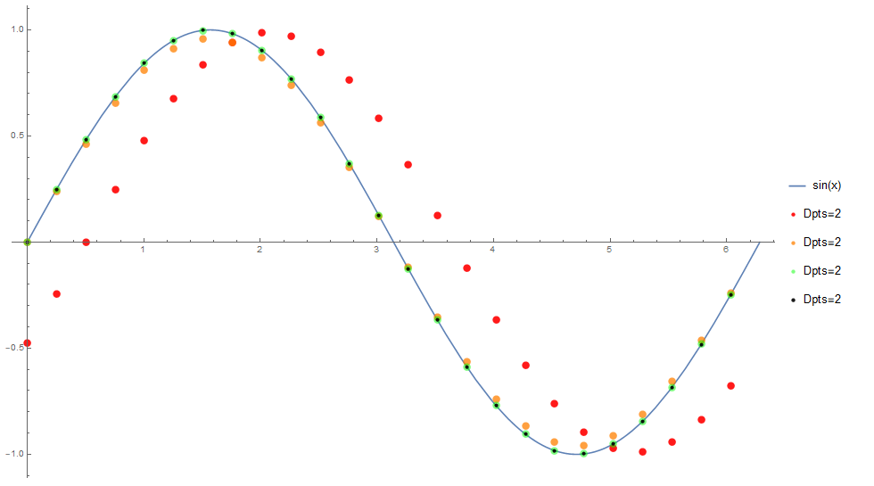

# Calculus in mātricks
_This document was automatically generated from file_ **`calculus.cpp`** (mātricks-v2.16-r21).

## Integration
### Definite integrals
Integrating over an interval (a,b) yields a single number--the area under the curve.


**EXAMPLE 1**: Definite integrals
```C++
const size_type N = 100000;
const double a = 0;
const double b = 1;
Vector<double> x(linspace_ab<double>(a,b,N));
Vector<double> f;
f=-log(log(1/x));
```

Integrating f(x), as given above, yields the [Euler–Mascheroni](http://mathworld.wolfram.com/Euler-MascheroniConstant.html) constant whose exact value is `0.577215664901532...`.  The function _f_(_x_) is singular at both x=0 and x=1.  Thus we omitted these points. As the results show, many points are needed to achieve even a few digits of accuracy, due to the singularities. 

 

**Results**
```C++
  N = 100000; 
  a = 0; 
  b = 1; 
  integrate_a2b(f,a,b,0) = 0.577168; 
  integrate_a2b(f,a,b,1) = 0.577128; 
  integrate_a2b: Number of points must be odd N=100000
integrate_a2b(f,a,b,2) = 0.57709; 
```

### Semi-Definite Integrals
A semi-definite integral is created by replacing one of the end points with _x_.

* For the integral


use the method `f.integrate_a2x(a, b)` or the function `integrate_a2x(f, a, b)`.


* For the integral


use the method `f.integrate_x2b(a, b)` or the function `integrate_x2b(f, a, b)`.


Where [`a`,`b`] defines the interval being used


A semi-definite integral yields a function as its output.
Integration requires a cumulative sum.  Thus the caculation can not be accomplished via element-wise operations.  For this reasons these functions can be performed: 
  * on a Vector in place using `f.integrate_a2x(a, b)`, mimizing both memory usage and computation time.
  * on a Vector or expression using the function `integrate_a2x(f, a, b)`,  in which case a `new Vector` is created inside the function and returned. 
All of the remaining functions discussed in this page can be called in either manner.


**EXAMPLE 2**:  The error function integral
The [error function](http://mathworld.wolfram.com/Erf.html) is the following semi-definite integral of a Gaussian function (with zero mean and variance of 1/2).


```C++
const size_type N = 101;
const double a = 0;
const double b = 4;
const double pi = 3.14159265358979323846;
Vector<double> x( linspace<double>(a,b,N) );
Vector<double> gauss;
gauss = 2/sqrt(pi)*exp(-sqr(x));
Vector<double> erf = gauss;
erf.integrate_a2x(a,b);
set_mathematica_var_format();
                                                                               
** mātricks ERROR:    illegal format string "% 10.8e" passed to Format<double>
                                                                               
                                                                               
** mātricks ERROR:    illegal format string "%s + I*%s" passed to setFormatStringComplex
                                                                               
```

The results _x_ and _erf_(_x_) are:

```Mathematica
x = {
    0, 0.04, 0.08, 0.12, 0.16, 
    0.2, 0.24, 0.28, 0.32, 0.36, 
    0.4, 0.44, 0.48, 0.52, 0.56, 
    0.6, 0.64, 0.68, 0.72, 0.76, 
    0.8, 0.84, 0.88, 0.92, 0.96, 
    1, 1.04, 1.08, 1.12, 1.16, 
    1.2, 1.24, 1.28, 1.32, 1.36, 
    1.4, 1.44, 1.48, 1.52, 1.56, 
    1.6, 1.64, 1.68, 1.72, 1.76, 
    1.8, 1.84, 1.88, 1.92, 1.96, 
    2, 2.04, 2.08, 2.12, 2.16, 
    2.2, 2.24, 2.28, 2.32, 2.36, 
    2.4, 2.44, 2.48, 2.52, 2.56, 
    2.6, 2.64, 2.68, 2.72, 2.76, 
    2.8, 2.84, 2.88, 2.92, 2.96, 
    3, 3.04, 3.08, 3.12, 3.16, 
    3.2, 3.24, 3.28, 3.32, 3.36, 
    3.4, 3.44, 3.48, 3.52, 3.56, 
    3.6, 3.64, 3.68, 3.72, 3.76, 
    3.8, 3.84, 3.88, 3.92, 3.96, 
    4
}; 
erf = {
    0, 0.0450991, 0.0900542, 0.134723, 0.178965, 
    0.222645, 0.265632, 0.307802, 0.349039, 0.389235, 
    0.42829, 0.466116, 0.502635, 0.537779, 0.571493, 
    0.60373, 0.634458, 0.663653, 0.691304, 0.717408, 
    0.741974, 0.765018, 0.786565, 0.806649, 0.825309, 
    0.84259, 0.858544, 0.873225, 0.886692, 0.899005, 
    0.910228, 0.920425, 0.929659, 0.937996, 0.945497, 
    0.952226, 0.958242, 0.963604, 0.968368, 0.972587, 
    0.976311, 0.979588, 0.982463, 0.984976, 0.987166, 
    0.989069, 0.990717, 0.99214, 0.993364, 0.994414, 
    0.995311, 0.996076, 0.996726, 0.997276, 0.997741, 
    0.998132, 0.99846, 0.998734, 0.998962, 0.999152, 
    0.999309, 0.999439, 0.999546, 0.999633, 0.999705, 
    0.999763, 0.99981, 0.999849, 0.99988, 0.999905, 
    0.999925, 0.999941, 0.999953, 0.999963, 0.999971, 
    0.999978, 0.999983, 0.999987, 0.99999, 0.999992, 
    0.999994, 0.999995, 0.999996, 0.999997, 0.999998, 
    0.999998, 0.999999, 0.999999, 0.999999, 1, 
    1, 1, 1, 1, 1, 
    1, 1, 1, 1, 1, 
    1
}; 
```
Cut and paste the above data for `x` and `erf` into Mathematica as well as the following commands

```Mathematica
p1=ListPlot[Partition[Riffle[x,erf],2],PlotStyle->Red];
p2=Plot[Erf[0,x],{x,0,4}];
Show[p1,p2]
```
This yields the following plot comparing the results above [red dots] to the exact function [solid blue].

### Semi-Definite Integrals: optional parameters
The optional `order` parameter specifies the integration method order: 

* 0 for rectangular integration

* 1 for trapezoidal integration (DEFAULT).

Usage: 

* `f.integrate_x2b(a, b, order)`
* `integrate_x2b(f, a, b, order)`
## Differentiation
* Differentiation requires points around it.   The derivative can be performed :
  * on a Vector in place using `f.deriv(a, b)`, mimizing both memory usage and computation time.
  * on a Vector or expression using the function `deriv(f, a, b)`,  in which case a `new Vector` is created inside the function and returned. 


**EXAMPLE 3**: Derivative of the function _f_(_x_) = 5 _x_


The derivative of the function _f_(_x_) = is the constant 5
```C++
set_default_format();
                                                                               
** mātricks ERROR:    illegal format string "(%s, %s)" passed to setFormatStringComplex
                                                                               
const double pi = 3.14159265358979323846;
const size_type N = 11;
const double a = 0;
const double b = 1;
Vector<double> x( linspace<double>(a,b,N) );
```

**Results**
```C++
  x = {0,0.1,0.2,0.3,0.4,0.5,0.6,0.7,0.8,0.9,1}; 
  deriv(5*x,a,b) = {5,5,5,5,5,5,5,5,5,5,5}; 
```

### Differentiation: optional parameters
* The differentiation method/function has 3 optional parameters:
  * `f.deriv(a, b, n, Dpts, periodic)` or `deriv(f, a, b, n, Dpts, periodic)`
* The optional parameters are:
  * `n` [DEFAULT=`1`] is the number of derivatives to compute: 
  * `Dpts` [DEFAULT=`7`] is the number of points to use in the calculation: 2,3,5, or 7.  More points yield better accuracy. 
  * `periodic` [DEFAULT=`false`]. When set to `true` the derivative at the end points will be of higher accuracy for periodic function.
### Differentiation: taking multiple derivatives in one call


**EXAMPLE 4**: The fourth derivative of sin _x_


Here we take the 4th derivative of sin _x_ using `Dpts`=2,3,5, and 7 points. The result for all should be sin _x_:


We also set `periodic=true` since sin _x_ is periodic over [0,2pi)
```C++
set_mathematica_var_format();
                                                                               
** mātricks ERROR:    illegal format string "% 10.8e" passed to Format<double>
                                                                               
                                                                               
** mātricks ERROR:    illegal format string "%s + I*%s" passed to setFormatStringComplex
                                                                               
const double pi = 3.14159265358979323846;
const size_type N = 25;
const double a = 0;
const double b = 2*pi;
Vector<double> x( linspace_b<double>(a,b,N) );
Vector<double> f = sin(x);
Vector<double> f2 = deriv(f,a,b,4,2,true );
Vector<double> f3 = deriv(f,a,b,4,3,true );
Vector<double> f5 = deriv(f,a,b,4,5,true );
Vector<double> f7 = deriv(f,a,b,4,7,true );
```

```Mathematica
x = {
    0, 0.251327, 0.502655, 0.753982, 1.00531, 
    1.25664, 1.50796, 1.75929, 2.01062, 2.26195, 
    2.51327, 2.7646, 3.01593, 3.26726, 3.51858, 
    3.76991, 4.02124, 4.27257, 4.52389, 4.77522, 
    5.02655, 5.27788, 5.5292, 5.78053, 6.03186
}; 
f2 = {
    -0.404889, -0.209011, 3.3417 10^-13, 0.209011, 0.404889, 
    0.575326, 0.709613, 0.799313, 0.838789, 0.825561, 
    0.760459, 0.647576, 0.494002, 0.309389, 0.105336, 
    -0.105336, -0.309389, -0.494002, -0.647576, -0.760459, 
    -0.825561, -0.838789, -0.799313, -0.709613, -0.575326
}; 
f3 = {
    3.94389 10^-14, 0.202496, 0.392268, 0.557393, 0.687494, 
    0.774398, 0.812644, 0.799828, 0.736756, 0.627391, 
    0.478604, 0.299746, 0.102053, -0.102053, -0.299746, 
    -0.478604, -0.627391, -0.736756, -0.799828, -0.812644, 
    -0.774398, -0.687494, -0.557393, -0.392268, -0.202496
}; 
f5 = {
    1.10047 10^-13, 0.211112, 0.40896, 0.581111, 0.716748, 
    0.80735, 0.847223, 0.833862, 0.768106, 0.654087, 
    0.49897, 0.3125, 0.106395, -0.106395, -0.3125, 
    -0.49897, -0.654087, -0.768106, -0.833862, -0.847223, 
    -0.80735, -0.716748, -0.581111, -0.40896, -0.211112
}; 
f7 = {
    1.4938 10^-13, 0.211222, 0.409173, 0.581414, 0.717122, 
    0.807771, 0.847665, 0.834296, 0.768506, 0.654428, 
    0.49923, 0.312663, 0.106451, -0.106451, -0.312663, 
    -0.49923, -0.654428, -0.768506, -0.834296, -0.847665, 
    -0.807771, -0.717122, -0.581414, -0.409173, -0.211222
}; 
```
Cut and paste the above data for `x`, `f2`, `f3`,...  into Mathematica as well as the following commands

```Mathematica
p2 = ListPlot[Partition[Riffle[x, f2], 2], PlotStyle -> {Red, PointSize[0.01], Opacity[0.9]},PlotLegends -> {"Dpts=2"}];
p3 = ListPlot[Partition[Riffle[x, f3], 2], PlotStyle -> {Orange, PointSize[0.01], Opacity[0.75]}, PlotLegends -> {"Dpts=3"}];
p5 = ListPlot[Partition[Riffle[x, f5], 2], PlotStyle -> {Green, PointSize[0.01], Opacity[0.5]}, PlotLegends -> {"Dpts=5"}];
p7 = ListPlot[Partition[Riffle[x, f7], 2],PlotStyle -> {Black, PointSize[0.005], Opacity[0.9]}, PlotLegends -> {"Dpts=7"}];
p = Plot[Sin[x], {x, 0, 2*Pi}, PlotLegends -> {"sin(x)"}];
Show[p, p2, p3, p5, p7]
```
This yields the following plot comparing the results above [dots] to the exact function [solid blue].

From these results we observe:
* the 2 point derivative has a bias that shifts the data to the right by 1/2 a grid point for each derivative taken.
* the 3 point derivative is approximately correct: rms error = 2.9%
* the 5 point derivative is very accurate:         rms error = 0.04%
* the 7 point derivative is even more accurate:    rms error = 5ppm


The root mean square (rms) errors were calculated in Mathematica using the following commands.
```Mathematica
RootMeanSquare[f2 - Sin[x]]*100
RootMeanSquare[f3 - Sin[x]]*100
RootMeanSquare[f5 - Sin[x]]*100
RootMeanSquare[f7 - Sin[x]]*10^6
```
## Various functions related to integration and differentiation
All of these functions can be called _either_ as a method, eg `v.cumsum()` or a function `cumsum(v)`.


**EXAMPLE 5**: Various functions: `cumsum`, `cumprod`, `cumtrapz`, `diff`, etc
```C++
set_default_format();
                                                                               
** mātricks ERROR:    illegal format string "(%s, %s)" passed to setFormatStringComplex
                                                                               
Vector<double> v1(5);
```

**Some expressions with results**
```C++
  v1 = {1,4,9,16,25} = {1,4,9,16,25}; 
  v1.cumsum() = {1,5,14,30,55}; 
  v1 = {1,4,9,16,25} = {1,4,9,16,25}; 
  v1.cumtrapz() = {0,2.5,9,21.5,42}; 
  v1 = {1,2,3,4,5} = {1,2,3,4,5}; 
  v1.cumprod() = {1,2,6,24,120}; 
  v1 = {1,4,9,16,25} = {1,4,9,16,25}; 
  v1.diff() = {3,3,5,7,9}; 
  v1 = {1,4,9,16,25} = {1,4,9,16,25}; 
  v1.diff(true) = {-24,3,5,7,9}; 
  v1 = {25,16,9,4,1} = {25,16,9,4,1}; 
  v1.cumsum_rev() = {55,30,14,5,1}; 
  v1 = {25,16,9,4,1} = {25,16,9,4,1}; 
  v1.cumtrapz_rev() = {42,21.5,9,2.5,0}; 
  v1 = {5,4,3,2,1} = {5,4,3,2,1}; 
  v1.cumprod_rev() = {120,24,6,2,1}; 
  v1 = {1,4,9,16,25} = {1,4,9,16,25}; 
  v1.diff_rev() = {3,5,7,9,9}; 
  v1 = {1,4,9,16,25} = {1,4,9,16,25}; 
  v1.diff_rev(true) = {3,5,7,9,-24}; 
```

The suffix `_rev` denote that the function starts at the highest element instead of the lowest element. Passing `true` to diff signifies that the function is periodic over the interval [a,b]. 

[Table of Contents](README.md)
