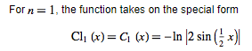
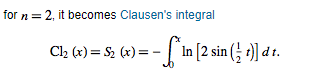

# Calculating a function via Fourier series and plotting the results in Matlab
_This document was automatically generated from file_ **`fourier.cpp`** (mātricks-v2.16-r20).

## Fourier Series for the Clausen Functions
As our example, we'll use the [Clausen functions](http://mathworld.wolfram.com/ClausenFunction.html). The Clausen function of order _n_ has Fourier series: 

### Clausen function of order _n=1_


Set up the output format so that we can copy and paste into Matlab
```C++
using namespace display;
FormatDataVector::string_opening = "[ ...\n    ";
FormatDataVector::string_delimeter = ", ";
FormatDataVector::max_elements_per_line = 5;
FormatDataVector::string_endofline = " ...\n    ";
FormatDataVector::string_closing = " ...\n]";
setFormatString<double>("% 10.8e");
                                                                               
** mātricks ERROR:    illegal format string "% 10.8e" passed to Format<double>
                                                                               
FormatData<double>::tens = false;
```

Define the coefficient vectors: 

```C++
const size_type N = 20;
Vector<double> k = range<double>(0,N-1);
Vector<double> An = 1/k;
An[0] = 0.;
Vector<double> Bn = Vector<double>(N,0.);
```

Define the coordinate vector `t` as 51 points over the interval [0,+2pi]: 

```C++
const double pi = 3.14159265358979323846;
Vector<double> t = linspace<double>(0,2*pi,51);
```

Calculate the Fourier series and store the results in vector `CL1`: 

```C++
const double T = 2*pi;
const double omega = 2*pi/T;
Vector<double> CL1 = ifourier(An,Bn, t, An.size(), omega );
```

The results `t` and `CL1` are:

```Matlab
t = [ ...
    double, double, double, double, double,  ...
    double, double, double, double, double,  ...
    double, double, double, double, double,  ...
    double, double, double, double, double,  ...
    double, double, double, double, double,  ...
    double, double, double, double, double,  ...
    double, double, double, double, double,  ...
    double, double, double, double, double,  ...
    double, double, double, double, double,  ...
    double, double, double, double, double,  ...
    double ...
]; 
CL1 = [ ...
    double, double, double, double, double,  ...
    double, double, double, double, double,  ...
    double, double, double, double, double,  ...
    double, double, double, double, double,  ...
    double, double, double, double, double,  ...
    double, double, double, double, double,  ...
    double, double, double, double, double,  ...
    double, double, double, double, double,  ...
    double, double, double, double, double,  ...
    double, double, double, double, double,  ...
    double ...
]; 
```
Cut and paste the above data for `t` and `CL1` into Matlab as well as the following commands

```Matlab
N=10000;
dt=2*pi/N;
tt=linspace(dt,2*pi-dt,10000);
y1=-log(2*abs(sin(tt/2)));
plot(t,CL1,'r.',tt,y1)
```
The above matlab code calculates the first Clausen function using the equation





We exclude the end points, 0 and pi, because the function is infinite at these points.
This yields the following plot comparing the Fourier series [red dots] to the exact function [solid blue].

### Clausen function of order _n=2_


Set up the output format so that we can copy and paste into Matlab, this time using the function `set_matlab_var_format()`
```C++
set_matlab_var_format();
                                                                               
** mātricks ERROR:    illegal format string "% 10.8e" passed to Format<double>
                                                                               
                                                                               
** mātricks ERROR:    illegal format string "%s + i*%s" passed to setFormatStringComplex
                                                                               
```

Define the coefficient vectors: 

```C++
const size_type N = 20;
Vector<double> k = range<double>(0,N-1);
Vector<double> An = Vector<double>(N,0.);
Vector<double> Bn = 1./sqr(k);
Bn[0] = 0.;
```

Define the coordinate vector `t` as 51 points over the interval [0,+2pi]: 

```C++
const double pi = 3.14159265358979323846;
Vector<double> t = linspace<double>(0,2*pi,51);
```

Calculate the Fourier series and store the results in vector `CL2`: 

```C++
const double T = 2*pi;
const double omega = 2*pi/T;
Vector<double> CL2 = ifourier(An,Bn, t, An.size(), omega );
```

The results `t` and `CL2` are:

```Matlab
t = [ ...
    double, double, double, double, double,  ...
    double, double, double, double, double,  ...
    double, double, double, double, double,  ...
    double, double, double, double, double,  ...
    double, double, double, double, double,  ...
    double, double, double, double, double,  ...
    double, double, double, double, double,  ...
    double, double, double, double, double,  ...
    double, double, double, double, double,  ...
    double, double, double, double, double,  ...
    double ...
]; 
CL2 = [ ...
    double, double, double, double, double,  ...
    double, double, double, double, double,  ...
    double, double, double, double, double,  ...
    double, double, double, double, double,  ...
    double, double, double, double, double,  ...
    double, double, double, double, double,  ...
    double, double, double, double, double,  ...
    double, double, double, double, double,  ...
    double, double, double, double, double,  ...
    double, double, double, double, double,  ...
    double ...
]; 
```
Cut and paste the above data for t and CL2 into Matlab as well as the following commands.

```Matlab
N=10000;
dt=2*pi/N;
tt=linspace(dt,2*pi-dt,10000);
y2=cumtrapz(-log(2*abs(sin(tt/2))))*dt;
plot(t,CL2,'r.',tt,y2)
```
The above matlab code calculates the second Clausen function using the following integral





We exclude the end points, 0 and pi, because the integrand is infinite at these points.
This yields the following plot comparing the Fourier series [red dots] to the exact function [solid blue].


[Table of Contents](README.md)
