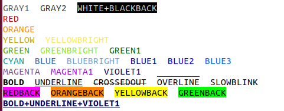

# \*Formatted and styled printing in mātricks
_This document was automatically generated from file_ **`vprint.cpp`** (mātricks-v2.15-r46).

* The examples in this section can be found in file_ `examples/printing.cpp`

* All of the functions decribed in this section are in the namespace `display`
* Practically speaking, this functionality is one of the most useful aspects of mātricks.
## The function `disp(x)`


The function `disp(x)` displays both the variable name (or expression) as well as its value, formatted according to the user.   This is an incredibly useful function.


**EXAMPLE 1**: simple examples of `disp(x)` usage


Define and initialize some variables:


```C++
int n = 45;
double x = 3.14;
double vals[] = {1.1,2.2,3.3};
bool done = true;
Vector<double> v = range<double>(1,10);
char str[] = "hello";
std::string s = "world";
std::complex<double> z(1,-1);
```
display each variable using `disp`:


```C++
disp(n);
disp(x);
disp(vals);
disp(done);
disp(v);
disp(str);
disp(s);
disp(z);
```


The actual screen-shot of the output is shown below:


## The function `tdisp(x)`


The function `tdisp(x)` displays the variable type, in addition to the variable name and value


**EXAMPLE 2**:  `tdisp(x)` usage


```C++
tdisp(n);
tdisp(x);
tdisp(vals);
tdisp(done);
tdisp(v);
tdisp(str);
tdisp(s);
tdisp(z);
```


The actual screen-shot of the output is shown below:


## The function `mdisp(x1,x2,...)`


* The function `mdisp(x1,x2,...)` displays multiple variables (from 1 to 10) on the same line.
* Very useful for displaying:
  * the arguments passed to a function
  * the variables inside a for loop


**EXAMPLE 3**:  `mdisp(x1,x2,...)` usage


```C++
mdisp(n,x,vals,done,str,s,z);
```


The actual screen-shot of the output is shown below:


## Displaying expressions


* The functions introduced above can also be used to display expressions.
* vector and matrix expressions can be displayed in this manner.


**EXAMPLE 4**:  displaying expressions


```C++
disp(n+3);
disp(10*x-1);
disp(!done);
disp( round(10*sin(pi/10*v) + 10) );
disp(s+" tour");
```


The actual screen-shot of the output is shown below:


## Supported Types


The following types are currently supported by the display commands
* **Any class** with methods `.classname()` and `operator<<` is automatically supported
* `matricks::Vector<D>` vectors
* `matricks::Matrix<D>` matrices
* `bool`
* `short`, `int`, `long`, `long long`
* `unsigned short`, `unsigned int`, `unsigned long`, `unsigned long long`
* `float`, `double`, `long double`
* `char`, `unsigned char`
* `char[]` C-style strings
* `D[]` C-style arrays
* `std::string` C++ strings
* `std::complex<D>` complex numbers
* `std::vector` C++ vectors
* `std::valarray` C++ valarrays
* `std::vector` C++ vectors
* `std::list` C++ lists
* `std::queue` C++ queues
* `std::map` C++ maps
* `std::initializer_list` C++11 
## Debug-only printing


### Debug-only printing: `disp[123]`, `tdisp[123]`, `mdisp[123]`


The display commands also have versions that only display when the code is compiled with the debug flag `MATRICKS_DEBUG` set.
* `disp1`, `tdisp1`, `mdisp1` will
  * when `MATRICKS_DEBUG >= 1`: behave like `disp`, `tdisp`, `mdisp`
  * when `MATRICKS_DEBUG == 0` or is undefined: compile to null statements (ie no output and no real-time hit)
* `disp2`, `tdisp2`, `mdisp2` will
  * when `MATRICKS_DEBUG >= 2`: behave like `disp`, `tdisp`, `mdisp`
  * when `MATRICKS_DEBUG < 2` or is undefined: compile to null statements (ie no output and no real-time hit)
* `disp3`, `tdisp3`, `mdisp3` will
  * when `MATRICKS_DEBUG >= 3`: behave like `disp`, `tdisp`, `mdisp`
  * when `MATRICKS_DEBUG < 3` or is undefined: compile to null statements (ie no output and no real-time hit)
### Debug-only printing: `print[123]`, `printf[123]`


* The functions `print1`, `print2`, `print3` each take a single std::string (or C string) as input and print the string to the stream `mout` followed by a carriage return.
* The functions `printf1`, `printf2`, `printf3` function like printf, but actually use sprintf and then output to the stream `mout` using C++ methodlogy.
## Controlling the output stream and color
* All output uses C++ streams (*no* `printf`)
* By default all output is sent to `std::cout`
* The output stream can be set using `Terminal::setmout(std::ostream&)`.
For example to set the output to stderr:
```C++

Terminal::setmout(std::cerr);
```

* You can use the matricks output stream via `Terminal::getmout()` or the macro `mout`
For example, you can output a string:
```C++

mout << "Hello World" << std::endl;

```

* By default, matricks uses color when it detects that the output stream is connected to a terminal.
* By default, matricks disables color when it detects that the output stream is piped to a file.
* However, the user can override this behavior as follows

To force matricks to use plain text, use the following settings:
```C++

Terminal::setColorOverride(true);
Terminal::setOverrideValue(false);
```

To force matricks to use color text, use the following settings:
```C++

Terminal::setColorOverride(true);
Terminal::setOverrideValue(true);
```

This latter setting can be used to print in colors to a file, which will display properly when the file is viewed via a terminal command like `more`,`less`, or `cat`.


## The `Style` class
* Color and other text attributes are controlled using the [ANSI escape codes for terminals](https://en.wikipedia.org/wiki/ANSI_escape_code).

* matricks defines the class `Style` for applying color and other attributes, such as **bold**

* The predefined styles are shown below



You can combine the styles using the `+` sign


* To use any of these, use the `createStyle` macro as the following example illustrates
```C++

Style mystyle = createStyle(BOLD+RED);

mout << mystyle.apply("with style") + " without style " << std::endl;

```

The output from the above two lines of code is:


* _The Style class checks to see whether or not to actually use colors, as described in the previous sub-section_


### Custom styles
* The user can define a style for any foreground color and background color combination as follows:

```C++
int nf = 27;  // color for foreground
int nb = 227; // color for background
display::Style mystyle(nf,nb); 
display::mout << mystyle.apply("Hello World") << std::endl; 
```
* Style objects can added:

```C++
int nf = 27;  // color for foreground
int nb = 227; // color for background
display::Style mystyle(nf,nb);
display::Style bold(BOLD);
display::Style mybold = bold + mystyle;
display::mout << mybold.apply("Hello World") << std::endl; 
```
* Place the attributes, eg `BOLD`, `UNDERLINE`, before the color styles
* Wikipedia lists the allowable [8-bit color definitions](https://en.wikipedia.org/wiki/ANSI_escape_code#8-bit)

## Customizing the format and colors by data type


### Customizing number formats
You can set the number format for any of the primitive datatypes using template function `setFormatString<D>(std::string)`


**EXAMPLE 5**:  `double` number format
```C++
using namespace display;
double x = 2.51;
```

**Results**: The default format is `"%g"` which yields
```C++
  x = 2.51; 
```

```C++
setFormatString<double>("%+18.15f");
```

**Results**: The format `"%+18.15f"`  yields
```C++
  x = +2.510000000000000; 
```


**EXAMPLE 6**:  `int` number format
```C++
using namespace display;
int n = -1024;
```

**Results**: The default format is `"%d"` which yields
```C++
  n = -1024; 
```

```C++
setFormatString<int>("%10d");
```

**Results**: The format `"%10d"`  yields
```C++
  n =      -1024; 
```


### Customizing format for `char`,`string`, and `bool`
* The default format for `char` is `"%c"`
* The default format for `std::string` is `"%s"`
* For `bool` types, the following _class variables_ are used:
  * `FormatData<bool>::string_for_true`
  * `FormatData<bool>::string_for_false`
* The default `bool` string are `0` and `1`


```C++
using namespace display;
bool a = true;
```

**Results**: The default `bool` format which yields
```C++
  a = 1; 
  !a = 0; 
```


For example, we can change the bool display value to true/false as follows.
```C++
using namespace display;
FormatData<bool>::string_for_true = "true";
FormatData<bool>::string_for_false = "false";
```

**Results**: The above format yields
```C++
  a = true; 
  !a = false; 
```


### Customizing complex number format
The format for complex numbers is set using the function `setFormatStringComplex`.  The default format is `"(%s, %s)"`


**EXAMPLE 7**:  complex number formats
```C++
using namespace display;
std::complex<double> z(1,-2);
```


Default format: `"(%s, %s)"`

```C++
z = (1, -2); 
```


Matlab input format `"%s + i*%s"`

```C++
z = 1 + i*-2; 
```


Mathematica input format `"%s + I*%s"`

```C++
z = 1 + I*-2; 
```


Matlab output format / C++14 format `"%s + %si"`

```C++
z = 1 + -2i; 
```


Note that the format of the real and imaginary parts of `complex<D>` are controlled by the format string for the template data type.`

```C++
setFormatString<double>("%9.6f");
```
The above statement changes the display of `z` to

```C++
z =  1.000000 + -2.000000i; 
```
### Customizing Vector format
**TO DO**


The format for `matricks:Vector` output is controlled by the following static class variables.


|`FormatDataVector` class variable|default value|
|------------------|------------------------|
|string_opening| "{"|
|string_delimeter | ","|
|max_elements_per_line | matricks::maxsize|
|string_endofline | "\n"|
|string_closing |   "}"|


The function `set_mathematica_var_format()` sets these varibles as follows


|`FormatDataVector` class variable|Mathematica value|
|------------------|------------------------|
|string_opening| "{\n    " |
|string_delimeter | ", " |
|max_elements_per_line | 5 |
|string_endofline | "\n    " |
|string_closing |   "\n}"   |


The function `set_matlab_var_format()` sets these varibles as follows


|`FormatDataVector` class variable|Matlab value|
|------------------|------------------------|
|string_opening|   "[ ...\n    "  |
|string_delimeter | ", "  |
|max_elements_per_line | 5 |
|string_endofline |  " ...\n    "  |
|string_closing |   " ...\n]"  |

[Table of Contents](README.md)
