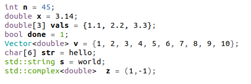
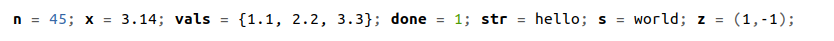
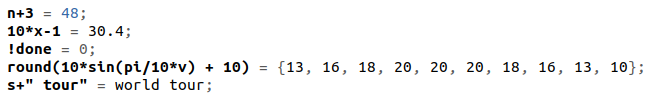

# \*Formatted and styled printing in mātricks
_This document was automatically generated from file_ **`vprint.cpp`** (mātricks-v2.15-r23).

* The examples in this section can be found in file_ `examples/printing.cpp`

* All of the functions decribed in this section are in the namespace `display`
* Practically speaking, this functionality is one of the most useful aspects of mātricks.
## The function `disp(x)`


The function `disp(x)` displays both the variable name (or expression) as well as its value, formatted according to the user.   This is an incredibly useful function.


**EXAMPLE 1**: simple examples of `disp(x)` usage


Define and initialize some variables:


```C++
int n = 45;
double x = 3.14;
double vals[] = {1.1,2.2,3.3};
bool done = true;
Vector<double> v = range<double>(1,10);
char str[] = "hello";
std::string s = "world";
std::complex<double> z(1,-1);
```
display each variable using `disp`:


```C++
disp(n);
disp(x);
disp(vals);
disp(done);
disp(v);
disp(str);
disp(s);
disp(z);
```


The actual screen-shot of the output is shown below:


## The function `tdisp(x)`


The function `tdisp(x)` displays the variable type, in addition to the variable name and value


**EXAMPLE 2**:  `tdisp(x)` usage


```C++
tdisp(n);
tdisp(x);
tdisp(vals);
tdisp(done);
tdisp(v);
tdisp(str);
tdisp(s);
tdisp(z);
```


The actual screen-shot of the output is shown below:



## The function `mdisp(x1,x2,...)`


* The function `mdisp(x1,x2,...)` displays multiple variables (from 1 to 10) on the same line.
* Very useful for displaying:
  * the arguments passed to a function
  * the variables inside a for loop


**EXAMPLE 3**:  `mdisp(x1,x2,...)` usage


```C++
mdisp(n,x,vals,done,str,s,z);
```


The actual screen-shot of the output is shown below:



## Displaying expressions


* The functions introduced above can also be used to display expressions.
* vector and matrix expressions can be displayed in this manner.


**EXAMPLE 4**:  displaying expressions


```C++
disp(n+3);
disp(10*x-1);
disp(!done);
disp( round(10*sin(pi/10*v) + 10) );
disp(s+" tour");
```


The actual screen-shot of the output is shown below:



## Supported Types


The following types are currently supported by the display commands
* **Any class** with methods `.classname()` and `operator<<` is automatically supported
* `matricks::Vector<D>` vectors
* `matricks::Matrix<D>` matrices
* `bool`
* `short`, `int`, `long`, `long long`
* `unsigned short`, `unsigned int`, `unsigned long`, `unsigned long long`
* `float`, `double`, `long double`
* `char`, `unsigned char`
* `char[]` C-style strings
* `D[]` C-style arrays
* `std::string` C++ strings
* `std::complex<D>` complex numbers
* `std::vector` C++ vectors
* `std::valarray` C++ valarrays
* `std::vector` C++ vectors
* `std::list` C++ lists
* `std::queue` C++ queues
* `std::map` C++ maps
* `std::initializer_list` C++11 
## Debug-only printing


The display commands also have versions that only display when the code is compiled with the debug flag `MATRICKS_DEBUG` set.
* `disp1`, `tdisp1`, `mdisp1` will
  * when `MATRICKS_DEBUG >= 1`: behave like `disp`, `tdisp`, `mdisp`
  * when `MATRICKS_DEBUG == 0` or is undefined: compile to null statements (ie no output and no real-time hit)
* `disp2`, `tdisp2`, `mdisp2` will
  * when `MATRICKS_DEBUG >= 2`: behave like `disp`, `tdisp`, `mdisp`
  * when `MATRICKS_DEBUG < 2` or is undefined: compile to null statements (ie no output and no real-time hit)
* `disp3`, `tdisp3`, `mdisp3` will
  * when `MATRICKS_DEBUG >= 3`: behave like `disp`, `tdisp`, `mdisp`
  * when `MATRICKS_DEBUG < 3` or is undefined: compile to null statements (ie no output and no real-time hit)
## Controlling the output stream and color
* All output uses C++ streams (*no* `printf`)
* By default all output is sent to `std::cout`
* The output stream can be set using `Terminal::setmout(std::ostream&)`.
For example to set the output to stderr:
```C++

Terminal::setmout(std::cerr);
```

* You can use the matricks output stream via `Terminal::getmout()` or the macro `mout`
For example, you can output a string:
```C++

mout << "Hello World" << std::endl;

```

* By default, matricks uses color when it detects that the output stream is connected to a terminal.
* By default, matricks disables color when it detects that the output stream is piped to a file.
* However, the user can override this behavior as follows

To force matricks to use plain text, use the following settings:
```C++

Terminal::setColorOverride(true);
Terminal::setOverrideValue(false);
```

To force matricks to use color text, use the following settings:
```C++

Terminal::setColorOverride(true);
Terminal::setOverrideValue(true);
```

This latter setting can be used to print in colors to a file, which will display properly when the file is viewed via a terminal command like `more`,`less`, or `cat`.


## Customizing the format and colors


### Customizing number format


### Customizing complex number format


### Customizing Vector format


[Table of Contents](README.md)
